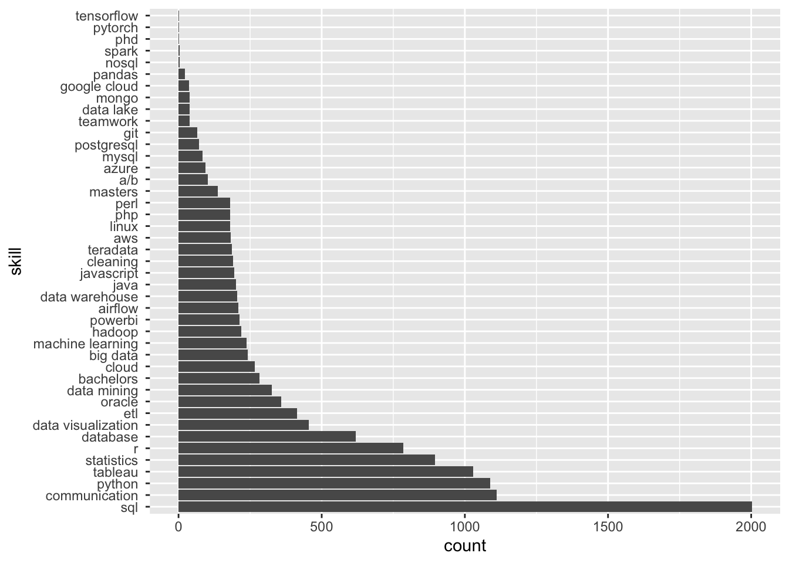

# Project 3: Which are the most valued data science skills?

**Authors**: Naomi Buell, Nick Kunze, Kaylie Evans\
**Date**: March 17, 2024

## Introduction

This project aims to answer the question, "which are the most value data science skills?" The process involves selecting a data set, normalizing the data, cleaning and tidying data, and performing an analysis. This GitHub includes all code and results. The following provides additional documentation of our motivation, approach, and findings.

### Motivation

As data science students, understanding which specific skills are highly valuable in our field can provide insights for those of us seeking to enter or advance within the field. Using data on the topic to come to a conclusion makes for a good exercise in data acquisition and analysis, and may further bolster these skills.

### Data Source and Approach

We use data on LinkedIn Data Analyst jobs listings from [Kaggle](https://www.kaggle.com/datasets/cedricaubin/linkedin-data-analyst-jobs-listings) (a CSV with 8,400+ rows of job titles, salaries, and descriptions) as our data source. First, we load it into our class Azure database using the Excel MySQL connector. From there, we normalize the table using SQL, and then clean, tidy, and analyze it in R.

## Setup

### Data Normalization

For normalization, job titles, companies, and onsite/remote felt like the most obvious fields to focus on for table decomposition. Focusing on these reduced a lot of data redundancy, with each being reduced to a few dozen titles, a few dozen companies, and only 3 types of onsite, remote, or hybrid. Each field got their own table with an auto-incrementing ID as their primary key, a VARCHAR containing their value, and the original jobs table having a foreign key referencing the value in these tables.

The Entity-Relationship (ER) diagram below shows the normalized tables we created in SQL before manipulating our data in R, including descriptions of the data they hold, and how they are connected. Foreign keys for job title id (title), company id (cid), and remote/onsite id (orid) are indicated by red diamonds. 

The database schema and data import was done through our ddl.sql file contents through MySQL Workbench.

**Figure 1: Entity-Relationship (ER) diagram**


### Required Packages

This project utilizes several R packages, including:

-   tidyverse
-   RMySQL
-   dplyr
-   stringr

Ensure that these packages are installed and loaded before running the code.

## Data Import

The job data is imported from a database hosted on the class Azure database. The `dbConnect` and `dbGetQuery` functions from the `RMySQL` package are used for data import.

## Data Dictionary

All cleaning and tidying was completed in R. Below descripes steps taken to prepare the following variables for analysis.

### Job Title

-   Since in order to be tidy, each cell must contain only one piece of information, the `title` column is tidied to remove additional information unrelated to job title within the cell, such as "Remote," "Hybrid," and "Onsite". Redudant information is verified against the existing `onsite_remote` column, for example.
-   Job title is standardized by using consistent capitalization and removing special characters.
-   The final job titles are stored in the `title_clean` column.

### Company

-   Verified no revisions needed.

### Description

-   `description` text is parsed through, ignoring case, for skills from existing keywords list. Each keyword was checked for with surrounding word boundaries (\\b) to prevent small character count keywords, such as "R", from being detected unless they were explicitly used. Skills were extracted into new normalized table `jobs.skills`, with one column for skill name and one column mapping skill to unique job listing ID.

### Onsite, Hybrid, or Remote status

-   Update `onsite_remote` variable type to factor variable. Confirmed no other revisions needed.

### Salary 

-  Populated new salary range columns
      - `sal_low` for low end of listed salary
      - `sal high` for high end of listed salary
- Populated missing salaries from other fields when applicable 

### Criteria

-   Criteria field held a JSON object with a few specific one-to-one fields, such as employment type (full-time, part-time) that could be converted into new columns as part of the tidying process. There was however, one JSON field which needed to be converted to its own new table with a foreign key pointing to the jobs table: industries. As industries could have one or more values, it represented a one-to-many relationship. We created a `jobs.industries` dataframe which holds the values in a value column along with an id column which points to the ID field in the `jobs` dataframe.

### Location

-   Location details are extracted from the `location` column into separate columns for city and state (not all locations specify both city and state).
-   States are standardized using state abbreviations from built-in R data set.
-   The final location variables are stored in the `title_clean` column.


### Company

-   `company` variable are reviewed for spelling errors. Confirmed no revisions needed.

## Analysis

### Analysis Decisions

- We define skill value in two different ways: 1) the frequency of requests for the skill in our sample of job postings and 2) the salary associated with the skill, according to job posting.
- Addressing outliers: some salaries were low outliers due to being reported as weekly, bi-weekly, or monthly salaries instead of annual salaries. We removed lower outliers for analyses involving salary data.
- Addressing missing salary data: we excluded observations without salary data from analyses involving salary.

### Results

#### Most Requested Data Science Skill

We determine the most requested skills (regardless of associated salary). Below is a list of the top 10 most requested skills in our sample of job postings, where `count` indicates the number of job postings in our sample that mentioned this skill, and `perc` is the percentage of postings in our sample that mentioned this skill. SQL is the most frequently requested data science skill, appearing in 70% of our sample of job postings. Having SQL skills may be valuable as they put you in contention for the most jobs-—nearly twice as many as if you had good communication skills.

**Table 1. Most Frequently Requested Skills**
```
## # A tibble: 10 × 3
##    value                  count  perc
##    <chr>                  <int> <dbl>
##  1 " sql "                 2002 0.704
##  2 " communication "       1112 0.391
##  3 " python "              1089 0.383
##  4 " tableau "             1030 0.362
##  5 " statistics "           896 0.315
##  6 " r "                    785 0.276
##  7 " database "             619 0.218
##  8 " data visualization "   454 0.160
##  9 " etl "                  413 0.145
## 10 " oracle "               358 0.126
```

The following figure displays the total number of requests for each skill, ranked from least requested to most requested. Interestingly, having a PHD is among the least frequently requested in our jobs postings. This may be due to our data set focusing on analyst positions in the field, whereas data scientists at the PHD-level may have more advanced positions. 

**Figure 2. Skill Request Counts**


#### Highest Valued Data Science Skill 

From these top skills, we can see that Python, R and statistics are the skills requested with the highest average salary associated with their job postings. The lowest value for salary is for job postings that do not contain any of the top skills, as well as the lowest IQR range values.

The following figure displays the IQR breakdown of average salaries and top skills from the rankings above. 

## Conclusion

The most valuable skills in terms of median salary offered is Python and R.
This README provides an overview of the project process. For detailed implementation and code snippets, refer to the R script.
