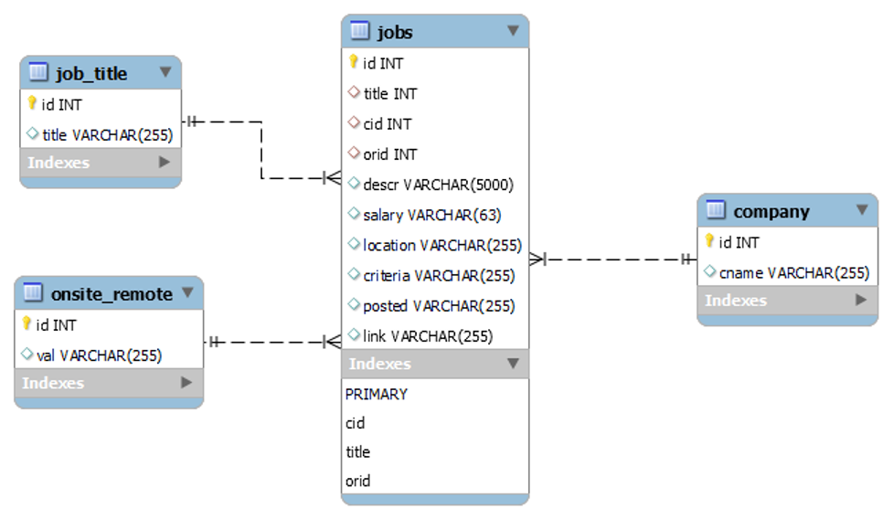

# Project 3: Which are the most valued data science skills?

**Authors**: Naomi Buell, Nick Kunze, Kaylie Evans\
**Date**: March 17, 2024

## Introduction

This project aims to answer the question, "which are the most value data science skills?" The process involves selecting a data set, normalizing the data, cleaning and tidying data, and performing an analysis. This GitHub includes all code and results. The following provides additional documentation of our motivation, approach, and findings.

### Motivation

As data science students, understanding which specific skills are highly valuable in our field can provide insights for those of us seeking to enter or advance within the field. Using data on the topic to come to a conclusion makes for a good exercise in data acquisition and analysis, and may further bolster these skills.

### Data Source and Approach

We use data on LinkedIn Data Analyst jobs listings from [Kaggle](https://www.kaggle.com/datasets/cedricaubin/linkedin-data-analyst-jobs-listings) (a CSV with 8,400+ rows of job titles, salaries, and descriptions) as our data source. First, we load it into our class Azure database using the Excel MySQL connector. From there, we normalize the table using SQL, and then clean, tidy, and analyze it in R.

## Setup

### Data Normalization

The Entity-Relationship (ER) diagram below shows the normalized tables we created in SQL before manipulating our data in R, including descriptions of the data they hold, and how they are connected. Foreign keys for job title id (title), company id (cid), and remote/onsite id (orid) are indicated by red diamonds. 

### Required Packages

This project utilizes several R packages, including:

-   tidyverse
-   RMySQL

Ensure that these packages are installed and loaded before running the code.

## Data Import

The job data is imported from a database hosted on the class Azure database. The `dbConnect` and `dbGetQuery` functions from the `RMySQL` package are used for data import.

## Data Dictionary

All cleaning and tidying was completed in R. Below descripes steps taken to prepare the following variables for analysis.

### Job Title

-   The `title` column is tidied to remove additional information unrelated to job title within the cell, such as "Remote," "Hybrid," and "Onsite". Redudant information is verified against the existing `onsite_remote` column, for example.
-   Job title is standardized by using consistent capitalization and removing special characters.
-   The final job titles are stored in the `title_clean` column.

### Company

-   Verified no revisions needed.

### Description

-   x

### Onsite, Hybrid, or Remote status

-   Updated `onsite_remote` variable type to factor variable. Confirmed no other revisions needed.

### Salary

-   x

### Criteria

-   x

### Location

-   Location details are extracted from the `location` column into separate columns for city and state (not all locations specify both city and state).
-   States are standardized using state abbreviations from built-in R data set.
-   The final location variables are stored in the `title_clean` column.

### Company

-   `company` variable are reviewed for spelling errors. Confirmed no revisions needed.

## Analysis

## Conclusion

This README provides an overview of the project process. For detailed implementation and code snippets, refer to the R script.
